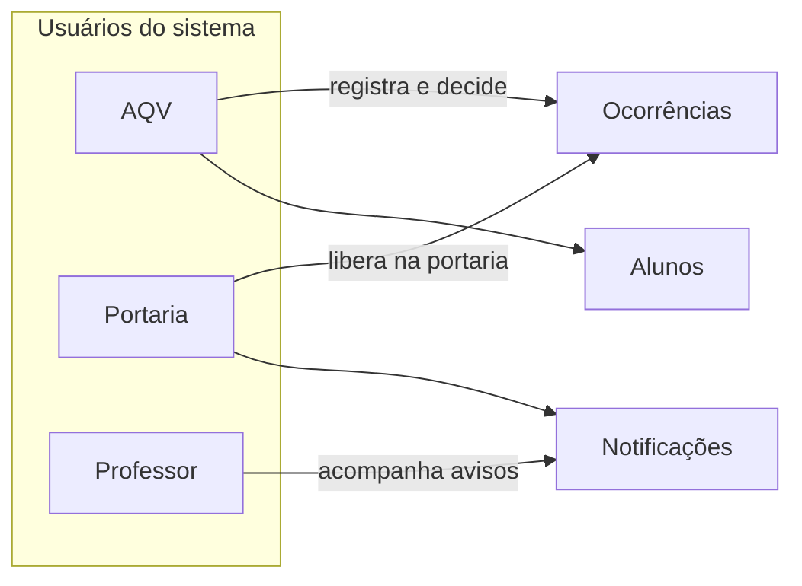
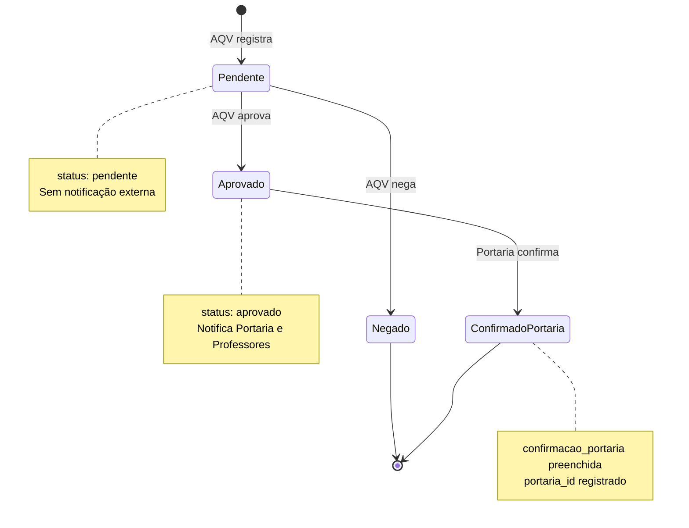
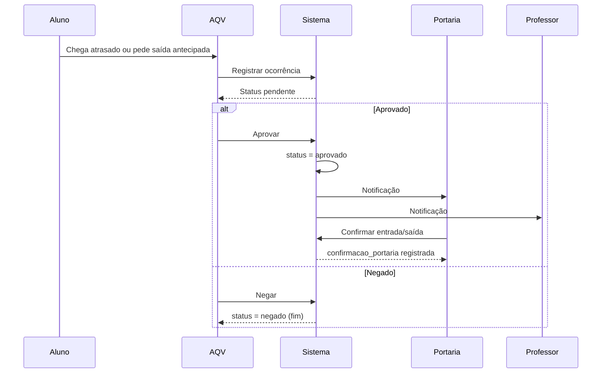
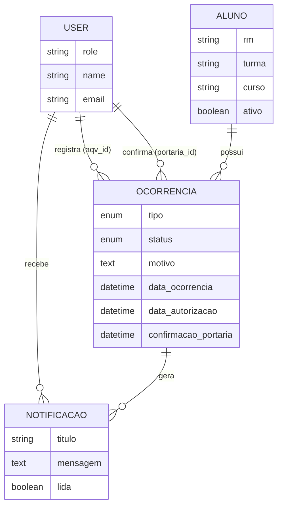

# Funcionalidade do Sistema Escolar

Este documento descreve **para que serve** o aplicativo, **quem usa**, **como funciona o fluxo** das ocorrências e o que cada tela oferece. É a documentação voltada a entender o negócio e o uso do sistema, não a instalação técnica.

Para instalação e estrutura de código, veja o [README](../README.md).

---

## 1. Objetivo do sistema

O **Sistema Escolar** centraliza o controle de situações em que um aluno precisa de autorização especial na escola:

| Tipo | Código no sistema | Situação real |
|------|-------------------|---------------|
| **Entrada atrasada** | `entrada_atrasada` | Aluno chegou depois do horário e precisa entrar com autorização |
| **Saída antecipada** | `saida_antecipada` | Aluno precisa sair antes do fim das aulas |

O sistema registra o pedido, passa por **aprovação da AQV** (Assistente de Qualidade de Vida / setor responsável), **avisa Portaria e Professores** quando aprovado, e permite que a **Portaria confirme** que o aluno efetivamente entrou ou saiu pelo portão.

---

## 2. Quem usa o sistema

Três perfis de usuário, definidos no cadastro (`role`):

### AQV — coordenação do processo

- Cadastra e mantém a lista de **alunos**
- **Registra** novas ocorrências quando um aluno chega atrasado ou precisa sair cedo
- **Aprova** ou **nega** cada ocorrência pendente
- Vê dashboard com totais do dia, pendentes e histórico

### Portaria — execução física na entrada/saída

- Vê no dashboard as **liberações aprovadas no dia**
- Consulta lista de ocorrências (somente **aprovadas**)
- **Confirma** quando o aluno passou pela portaria (entrada ou saída efetivada)

### Professor — acompanhamento pedagógico

- Recebe **notificações** quando uma ocorrência é aprovada (para saber que o aluno entrou tarde ou saiu antes)
- Dashboard com avisos recentes e contagem de não lidas
- Não registra nem aprova ocorrências pelo menu principal

---

## 3. Fluxo principal (ocorrência)

Este é o coração do aplicativo. Cada ocorrência passa por estados bem definidos.

### Passo a passo

| Etapa | Quem | O que acontece | Status / campos |
|-------|------|----------------|-----------------|
| **1. Registro** | AQV | Seleciona aluno, tipo (atraso/saída), motivo e observação opcional | `pendente`, `data_ocorrencia` = agora, `aqv_id` = usuário logado |
| **2. Decisão** | AQV | Na tela de detalhes: **Aprovar** ou **Negar** | `aprovado` ou `negado`, `data_autorizacao` = agora |
| **3. Notificação** | Sistema (automático) | Só se **aprovado**: cria notificação para **todos** usuários Portaria e **todos** Professores | Registros em `notificacoes` |
| **4. Confirmação** | Portaria | Na tela de detalhes de ocorrência **aprovada**: botão **Confirmar** | `confirmacao_portaria` = agora, `portaria_id` = usuário logado |

Se a ocorrência for **negada**, o fluxo termina: Portaria não precisa agir e **não** são enviadas notificações.

### Diagrama de sequência (visão completa)

---

## 4. Módulos e telas por perfil

### 4.1 Dashboard (`/dashboard`)

Cada perfil vê uma página diferente após o login.

| Perfil | Informações exibidas |
|--------|----------------------|
| **AQV** | Atrasos e saídas hoje, pendentes, aprovados hoje, total de alunos ativos; lista das 10 ocorrências recentes e 5 pendentes |
| **Portaria** | Liberações do dia (aprovadas hoje), entradas/saídas, quantas já foram confirmadas na portaria |
| **Professor** | Notificações (últimas 20), contagem de não lidas, ocorrências recentes para contexto |

### 4.2 Alunos (`/alunos`)

**Cadastro de alunos** com: nome, RM (único), turma, curso, responsável, telefone e e-mail do responsável, flag ativo/inativo.

| Ação | AQV | Portaria | Professor |
|------|-----|----------|-----------|
| Listar / buscar / filtrar por turma e curso | Sim (menu) | Via URL* | Via URL* |
| Ver ficha do aluno + histórico de ocorrências | Sim | Via URL* | Via URL* |
| Criar, editar, excluir aluno | Sim | Não | Não |

\*No menu lateral, apenas **AQV** tem o link “Alunos”. Outros perfis autenticados podem acessar listagem e detalhes se souberem a URL; criação/edição/exclusão retornam erro 403.

Na ficha do aluno, o sistema mostra estatísticas: total de atrasos, total de saídas antecipadas, e contagens do mês atual.

### 4.3 Ocorrências (`/ocorrencias`)

| Ação | AQV | Portaria | Professor |
|------|-----|----------|-----------|
| Listar ocorrências | Todas (com filtros) | **Somente aprovadas** | Sem item no menu* |
| Criar nova ocorrência | Sim | Não | Não |
| Ver detalhes | Sim | Sim | Via URL* |
| Aprovar / Negar (se pendente) | Sim | Não | Não |
| Confirmar na portaria (se aprovada e não confirmada) | Não | Sim | Não |

**Filtros na listagem:** tipo, status, data início/fim, busca por nome ou RM do aluno.

**Dados no registro (AQV):**
- Aluno (obrigatório, deve estar ativo)
- Tipo: entrada atrasada ou saída antecipada
- Motivo (texto, até 1000 caracteres)
- Observação (opcional)

### 4.4 Notificações (`/notificacoes`)

Disponível para **todos** os perfis no menu.

- Geradas automaticamente na **aprovação** da ocorrência
- Cada notificação tem título, mensagem e vínculo com a ocorrência
- Ao abrir a página de notificações, o sistema **marca todas como lidas** do usuário logado
- Contador de não lidas na barra lateral (atualizado via API `/api/notificacoes/count`)

**Conteúdo típico das mensagens:**

| Destinatário | Exemplo de título |
|--------------|-------------------|
| Portaria | "Nova autorização: [nome do aluno]" |
| Professor | "Aluno com Entrada Atrasada: [nome]" (inclui turma e motivo) |

---

## 5. Estados e regras de negócio

### Status da ocorrência

| Status | Significado | Próxima ação possível |
|--------|-------------|------------------------|
| `pendente` | Registrada, aguardando AQV | Aprovar ou Negar (só AQV) |
| `aprovado` | Autorizada pela AQV | Portaria pode confirmar |
| `negado` | Recusada pela AQV | Nenhuma (encerrada) |

### Confirmação da portaria

- Só aparece o botão **Confirmar** se: usuário é Portaria **e** status é `aprovado` **e** `confirmacao_portaria` ainda é nulo
- Após confirmar, fica registrado **quem** da portaria confirmou e **quando**

### Regras importantes

1. **Só alunos ativos** aparecem no formulário de nova ocorrência.
2. **Negar** não dispara notificações.
3. **Aprovar** notifica **todos** os usuários com perfil portaria e **todos** com perfil professor (não filtra por turma do aluno).
4. Ocorrências usam **exclusão lógica** (`soft delete`) no banco — registros antigos podem ser preservados para histórico.
5. A data da ocorrência (`data_ocorrencia`) é definida automaticamente no momento do registro.

---

## 6. Menu lateral (o que cada perfil vê)

| Item do menu | AQV | Portaria | Professor |
|--------------|:---:|:--------:|:---------:|
| Dashboard | ✓ | ✓ | ✓ |
| Ocorrências | ✓ | ✓ | — |
| Nova Ocorrência | ✓ | — | — |
| Alunos | ✓ | — | — |
| Notificações | ✓ | ✓ | ✓ |
| Sair | ✓ | ✓ | ✓ |

---

## 7. Cenários de uso (exemplos)

### Cenário A — Aluno chega atrasado

1. Aluno chega na escola fora do horário.
2. **AQV** registra ocorrência tipo **Entrada atrasada**, informa o motivo (ex.: consulta médica).
3. **AQV** abre o detalhe e clica **Aprovar**.
4. **Portaria** recebe notificação e vê a liberação no dashboard.
5. Aluno entra pelo portão; **Portaria** abre a ocorrência e clica **Confirmar**.
6. **Professores** foram notificados e podem acompanhar na sala de aula.

### Cenário B — Saída antecipada negada

1. Aluno solicita sair mais cedo sem justificativa aceita.
2. **AQV** registra **Saída antecipada**.
3. **AQV** clica **Negar**.
4. Fluxo encerra; Portaria e Professores **não** recebem aviso.
5. Aluno permanece na rotina normal da escola.

### Cenário C — Consulta de histórico

1. **AQV** acessa **Alunos**, busca pelo RM ou nome.
2. Abre a ficha do aluno e vê todas as ocorrências ligadas a ele, com totais de atrasos e saídas.

---

## 8. Modelo de dados (visão funcional)

---

## 9. Autenticação e acesso

- A página inicial (`/`) redireciona para **login**.
- Todas as rotas do painel exigem usuário autenticado.
- Ações sensíveis usam middleware de perfil (`role:aqv`, `role:portaria`) nas rotas de aprovar, negar e confirmar portaria.
- Login, registro e recuperação de senha vêm do **Laravel Breeze** (telas em `auth/`).

---

## 10. Limitações atuais (bom saber)

Estes pontos fazem parte do comportamento **atual** do código, úteis para quem for evoluir o sistema:

| Comportamento | Detalhe |
|---------------|---------|
| Notificação a professores | Enviada para **todos** os professores, não só da turma do aluno |
| Professor e menu Ocorrências | Não há link no menu; acesso à listagem só por URL direta |
| Após negar | Não há notificação ao responsável do aluno (só registro interno) |
| Edição de ocorrência | Não existe tela para alterar ocorrência após criada; apenas aprovar/negar/confirmar |

---

## 11. Glossário

| Termo | Significado no sistema |
|-------|------------------------|
| **AQV** | Perfil que gerencia alunos e autoriza ocorrências |
| **Ocorrência** | Registro de entrada atrasada ou saída antecipada de um aluno |
| **RM** | Registro/matricula única do aluno |
| **Liberação** | Ocorrência com status `aprovado`, pronta para a Portaria |
| **Confirmação** | Registro de que a Portaria efetivou a entrada/saída física |

---

*Documento alinhado ao código em `app/Services/OcorrenciaService.php`, controllers e rotas em `routes/web.php`.*
